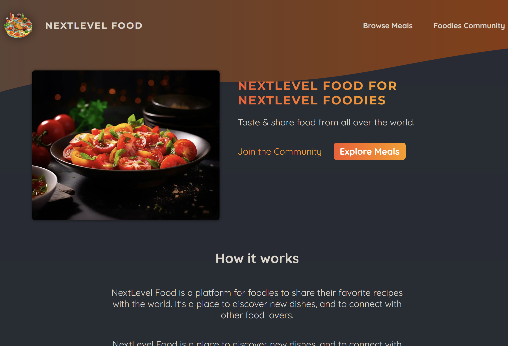
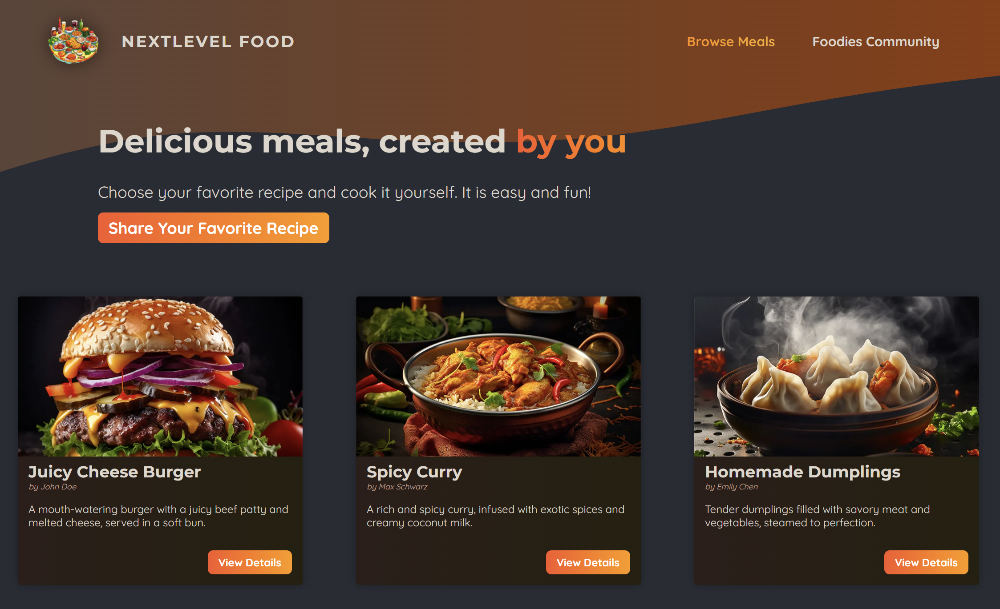
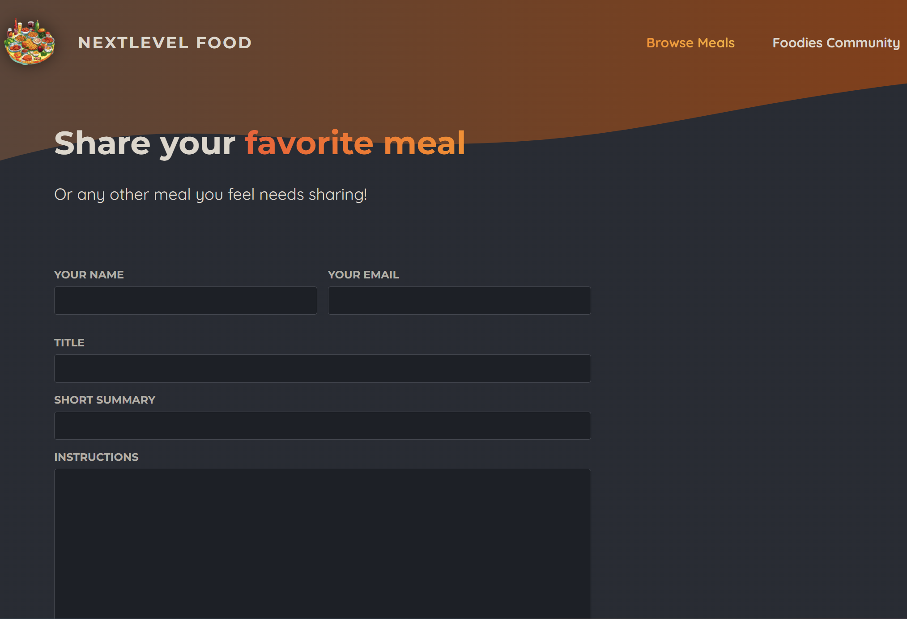

# Next Lever Food

A **Next.js 14** (App Router) demo application for browsing meals and sharing new recipes, with image uploads stored in **Cloudinary** and data stored in a local **SQLite** database.

## Features

- Browse meals and view meal details (slug-based routing)
- Share a new meal via a form (Next.js Server Actions)
- Image upload to Cloudinary
- SQLite persistence via `better-sqlite3`

## Tech Stack

- **Framework**: Next.js 14 (React 18)
- **Styling**: CSS Modules + global CSS
- **Database**: SQLite (`better-sqlite3`)
- **Uploads**: Cloudinary (`cloudinary`)
- **Utilities**: `slugify`, `xss`

## Requirements

- **Node.js**: 18+ (recommended 20+)
- **npm**: comes with Node.js

## Getting Started

### Clone the repository

```bash
git clone https://github.com/vasylpryimakdev/next-level-food.git
cd next-level-food
```

Install dependencies:

```bash
npm install
```

### Environment Variables

Create a `.env.local` file in the project root:

```bash
CLOUDINARY_CLOUD_NAME=your_cloud_name
CLOUDINARY_KEY=your_api_key
CLOUDINARY_SECRET=your_api_secret
```

These are used in `lib/cloudinary.js`.

### Database (SQLite)

This project uses a local SQLite file named `meals.db` (ignored by git via `*.db`).

- **Seed / initialize DB** (creates the `meals` table and inserts dummy data):

```bash
node initdb.js
```

If you don’t run this step, pages that query meals will return an empty list (or fail if the DB/table doesn’t exist yet, depending on your environment).

### Run the app

Start the development server:

```bash
npm run dev
```

Open `http://localhost:3000`.

## Scripts

- **dev**: `next dev`
- **build**: `next build`
- **start**: `next start`
- **lint**: `next lint`

## Project Structure

```text
app/                # Next.js App Router routes, layouts, pages
components/         # UI components (header, meals UI, image picker, etc.)
lib/
  actions.js        # Server Actions (share meal)
  meals.js          # DB queries + save logic (slugify, xss, image upload)
  cloudinary.js     # Cloudinary client config (env-based)
  upload-image.js   # Upload helper (Data URI -> Cloudinary)
initdb.js           # SQLite schema + seed data
```

## Screenshots

Add screenshots to `./public/screenshots/` and update/extend this section as needed.

### Preview

| Home | Meals |
| --- | --- |
|  |  |

| Meal details | Share meal |
| --- | --- |
|  |  |

## Notes

- **Cloudinary domains**: images are allowed from `res.cloudinary.com` (see `next.config.js`).
- **Security**: meal instructions are sanitized with `xss` before being stored.